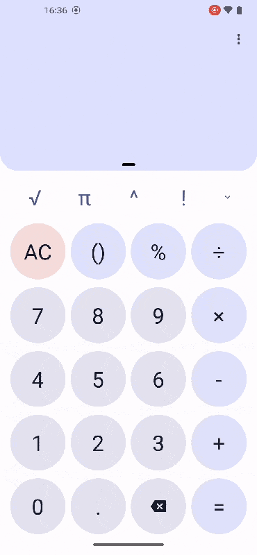
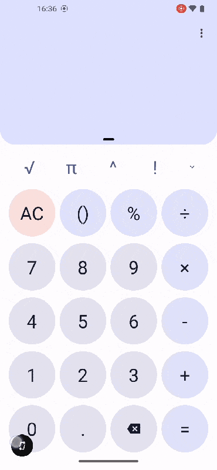
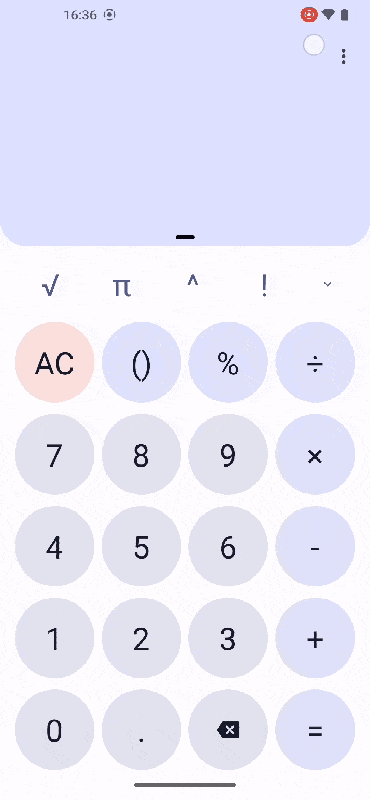

#Calculator
 Jetpack Compose 计算器
## 说明
本项目为 Jetpack Compose 计算器Demo

时间匆忙，只实现了部分功能，借鉴了谷歌最新的计算器
## 用途
参加 Compose学习挑战赛 `进阶赛` 参赛作品
## 介绍
* 完全由compose构建
* 实现基本+-*/运算
* 横竖屏自动切换布局
## 附加
* 支持动态取色
* 按钮文字大小自适应
* 使用了swipeable处理滑动交互
* 使用AnimatedVisibility处理显示隐藏动画

时间不够了（暂未实现）
* 输入框光标处理以及复杂计算（太菜了一时半会写不出来）
* 历史记录展示（计划用datastore或者database）
* 选择主题
## 演示
基本计算功能

交互

横竖屏切换

暗色主题切换
